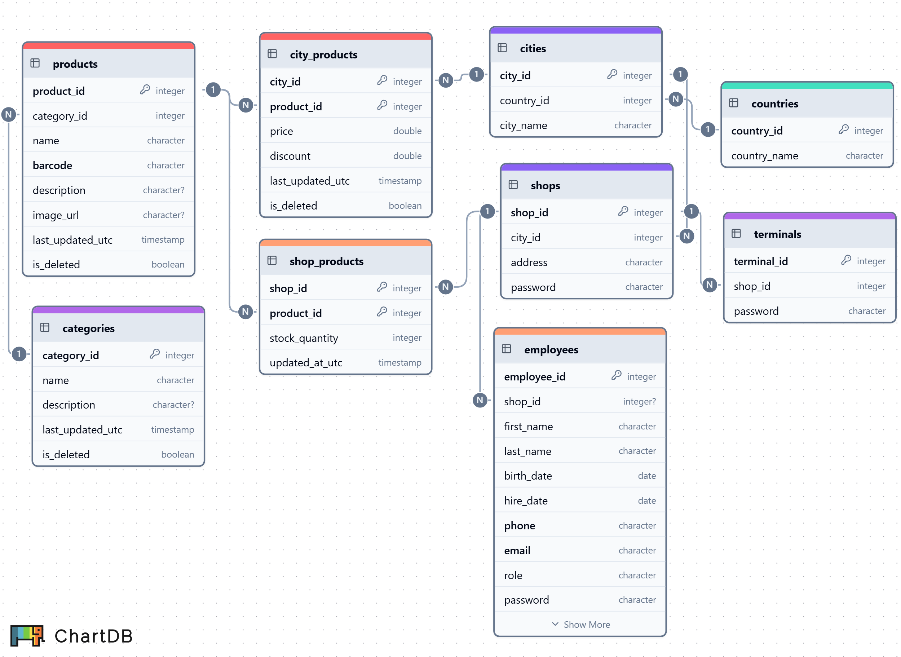

<!-- omit in toc -->
## Languages
[](#)
[](#)

## Frameworks
[](#)
[](#)
[](#)

## Services
[](#)
[](#)

<!-- omit in toc -->
## Table of Contents

- [Frameworks](#frameworks)
- [Services](#services)
- [Introduction](#introduction)
- [Project Workflow](#project-workflow)
- [Docker Containers](#docker-containers)
- [Database Schema](#database-schema)
- [Sync API](#sync-api)
- [Kafka Consumer](#kafka-consumer)
- [Getting Started](#getting-started)
- [Next Section of the Project](#next-section-of-the-project)

## Introduction
🟢 **This is part 2 of 7 Docker sections in the 🔴 [Supermarket Simulation Project](https://github.com/SerhiiDolhopolov/rossmann_services).**

🔵 [**<- Preview part with an introduction.**](https://github.com/SerhiiDolhopolov/rossmann_services)

## Project Workflow
This section contains the general OLTP database. The database is created using the [SQLAlchemy](https://www.sqlalchemy.org/) ORM. It is designed to synchronize with local store databases:

- The **last_updated_utc** attribute helps implement Kafka's idempotency mechanism, ensuring that old data does not overwrite new data.
- The **updated_at_utc** attribute indicates when the product quantity was last synchronized from a local shop.
- The **is_deleted** attribute is used for soft deletion to maintain data consistency. Since the tables with product information contain little data, column overhead is not significant.

## Docker Containers
**This Docker section includes:**
  - [Adminer](https://www.adminer.org/en/) for viewing SQL databases.
    - 🌐 Web interface:
      - [localhost:1000](http://localhost:1000)
  - [General OLTP DB](https://www.postgresql.org/)
    - Server for Adminer:
      - `oltp_db:5432`
    - Server for external tools:
      - `localhost:3000`
    - Other:
      - `admin`

## Database Schema
The schema was created at [chartdb.io](https://chartdb.io/).

The database also has triggers to update **last_updated_utc**.



## Sync API
The sync API for starting synchronization of offline markets is implemented via [FastAPI](https://fastapi.tiangolo.com/). The [Pydantic](https://docs.pydantic.dev/latest/) schemas are placed in a separate module so that offline stores can easily validate [Kafka](https://kafka.apache.org/) messages using them.

## Kafka Consumer
Three Kafka consumers receive messages from the topic **oltp_update_product_quantity** using shop_id as a key. Kafka consumers are implemented via [confluent-kafka](https://www.confluent.io/).

## Getting Started
**To start:**
1. Complete all steps in the [preview part](https://github.com/SerhiiDolhopolov/rossmann_services).
2. Run the services:
```bash
docker compose up --build
```

## Next Section of the Project

[Rossmann Offline Markets](https://github.com/SerhiiDolhopolov/rossmann_offline_markets)
